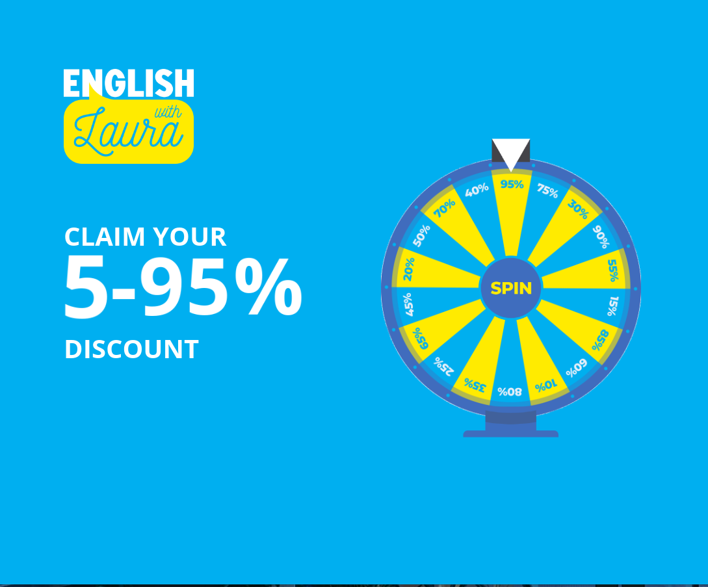
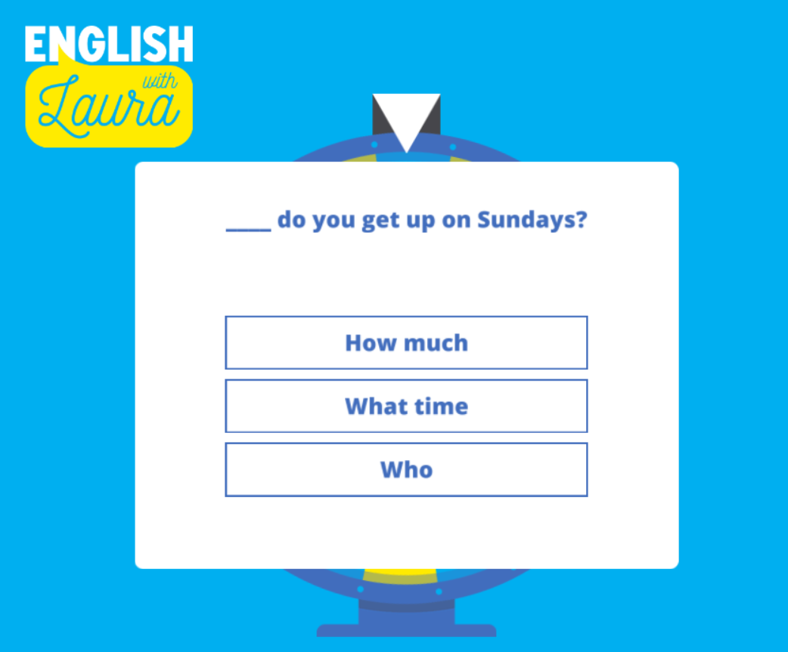

# Test App README

## Overview

Welcome to the Roulette Test App! This application has been designed to add an element of fun to learning English. Spin the roulette, get a discount, and test your English grammar knowledge to claim your discount for your next course. This app was created for an expo to demonstrate innovative ways to engage students in English teaching businesses.

## Features

- **Roulette Spin**: Users can spin a roulette to receive a random discount.
- **Grammar Quiz**: After receiving a discount, users must answer an English grammar question correctly to validate their discount for the next course.
- **Engaging Interface**: The app features a user-friendly and engaging interface to enhance the learning experience.

## Installation

To install and run the Test App, follow these steps:

1. Clone the repository:
2. Navigate to the project directory:
    ```bash
   http-server -p 5000 # any local server you would like 
    ```
## Usage

1. **Spin the Roulette**:
    - Launch the app and click on the "Spin" button.
    - The roulette will spin and land on a random discount value.

2. **Answer the Grammar Question**:
    - After receiving your discount, you will be presented with an English grammar question.
    - Answer the question correctly to validate your discount.

3. **Claim Your Discount**:
    - Once you answer the grammar question correctly, your discount will be applied to your next course purchase.

## Screenshots

### Home Screen


### Roulette Spin


### Grammar Question


